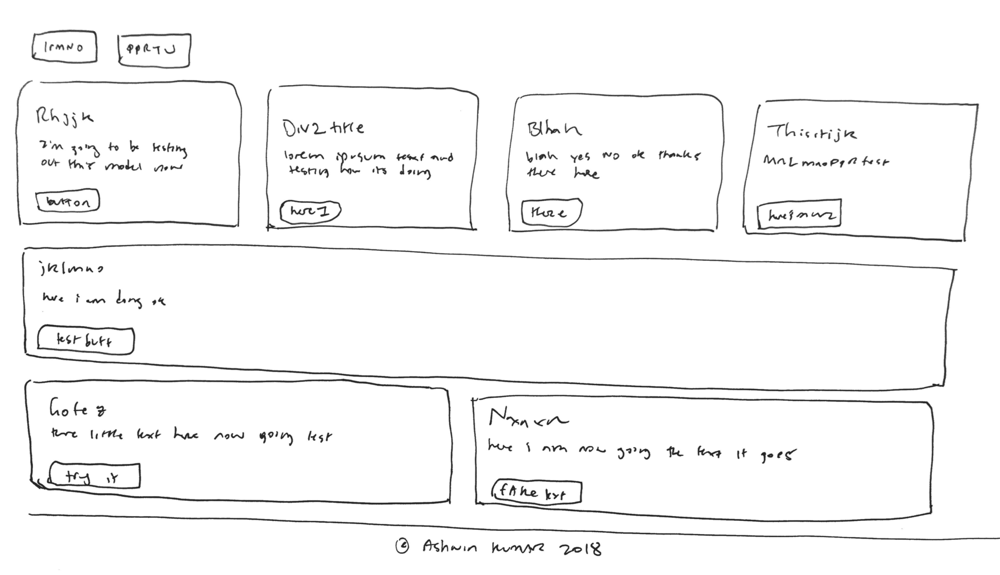
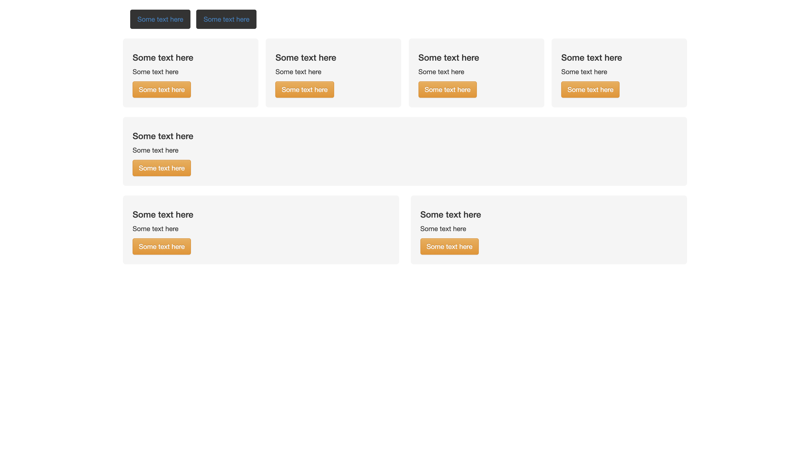

# sketchy-code
sketchy-code: Generating Code from Hand-drawn Sketch

## This is what it does

### Input Sketch drawing:

### Output `HTML/CSS` code (site):

Check out the code written by the machine [here](./src/notebooks/out.html). 

## Authors

* **Victor Velev** - *Initial work* - [VIVelev](https://github.com/VIVelev)

See also the list of [contributors](https://github.com/VIVelev/PyDojoML/contributors) who participated in this project.

## License

This project is licensed under the MIT License - see the [LICENSE](LICENSE) file for details
